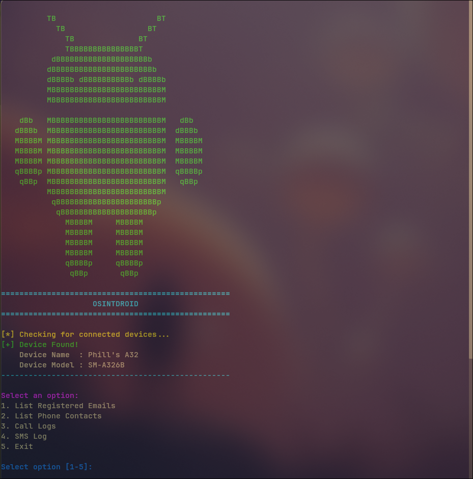

# OSINTDROID

**OSINTDROID** is an interactive Bash-based Open Source Intelligence (OSINT) and forensic extraction tool designed for Android devices. Utilizing the Android Debug Bridge (ADB), OSINTDROID provides security researchers, digital forensics examiners, and penetration testers with an automated menu to query critical artifacts directly from a connected Android device—including registered accounts, contact lists, call history, and SMS messages.

---

## ADB Commands of the Menu 

1. **Query Device Name**
   
   adb shell settings get global device_name

3. **Query Device Model**
   
   adb shell getprop ro.product.model

5. **List Registered Emails**
   
   adb shell dumpsys account

7. **List Phone Contacts**
   
   adb shell content query --uri content://com.android.contacts/data/phones --projection display_name:data1 

9. **List Call Logs**
    
    adb shell content query --uri content://call_log/calls --projection name:number:date:type 

11. **List SMS Log**
    
    adb shell content query --uri content://sms --projection address:body:type:date

---

## Features

- **Automated ADB Server Initialization:** Automatically checks for and starts the local ADB daemon process.
- **Device Authorization Check:** Identifies whether an authorized Android device is plugged in via USB and ready for debugging.
- **Device Hardware & System Information:** Queries global settings and system properties to dynamically display the connected device's name and model.
- **Interactive TUI Menu:** Keypress-driven interactive console allowing rapid extraction of key device artifacts.
- **Structured Data Formatting:** Uses Linux utilities like `column`, `awk`, and `fmt` to wrap, align, and clean raw content provider query outputs into human-readable tables.

---

## Prerequisites

Before running OSINTDROID, ensure you have the following installed and configured on your host system:

1. **Android Debug Bridge (`adb`):** Must be installed and available in your system `$PATH`.
   - **Arch Linux:** `sudo pacman -S android-tools`
   - **Debian/Ubuntu:** `sudo apt install android-tools-adb`
   - **Fedora:** `sudo dnf install android-tools`
2. **Standard Core Utilities:** `awk`, `grep`, `sort`, `column`, `fmt`.
3. **Target Android Device:**
   - **Developer Options** enabled.
   - **USB Debugging** enabled.
   - Host system authorized via the RSA prompt on the Android device screen.

---

## Installation & Setup

1. Clone or download this repository to your host machine:
   
   git clone [https://github.com/your-username/osintdroid.git](https://github.com/your-username/osintdroid.git)
   cd osintdroid

Disclaimer
This tool is created strictly for educational, authorized penetration testing, and digital forensics purposes. Always ensure you have explicit authorization before connecting to and extracting data from a mobile device. 
